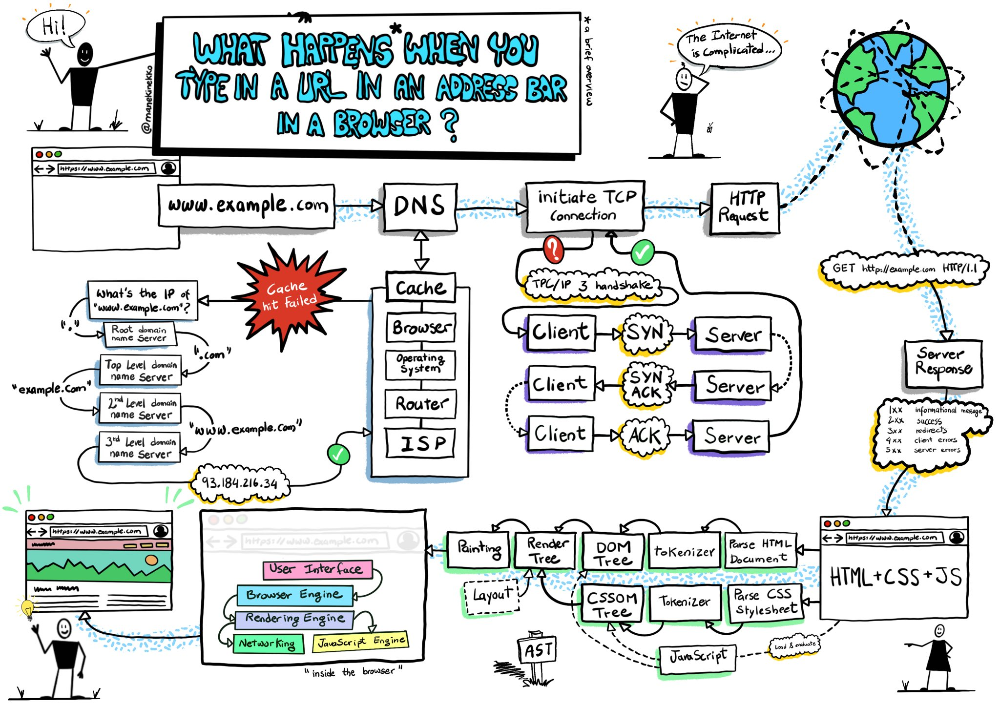

কি ঘটে যখন...
====================

এই রিপোজারিটা মূলত বিখ্যাত একটি পুরনো প্রশ্নের উত্তরের খোঁজে, "কি ঘটে যখন আপনি ব্রাউজারে google.com লিখে ঠাস করে এন্টার চাপ দেন?"। পুরো ব্যাপারটা `এই রিপো`_ থেকে অনুবাদ করা, তবে আমি চেষ্টা করেছি একেবারে লাইন বাই লাইন কপি না করে নিজের ভাষায় লিখার জন্য। সুতরাং প্রচুর ভুল ত্রুটি থাকবেই এটা স্বাভাবিক, খুঁজে পেলে PR পাঠান।

চলুন শুরু করা যাক...

Table of Contents
====================

.. contents::
   :backlinks: none
   :local:

যখন গুগলের 'g' কি প্রেস করা হয়
-------------------------
যখনই কেউ ব্রাউজারে google.com লেখার জন্য কি বোর্ডে 'g' প্রেস করে তখন ব্রাউজার এটিকে একটি ইভেন্ট হিসেবে গ্রহণ করে এবং সাধারণত অটো-কম্পিলিশন ফাংশন ট্রিগার করে। যদি আপনি প্রাইভেট/ইনকগনিটো মুডে থাকেন বা খুব বেশি সাজেশন যদি URL বার এর ড্রপডাউনে নাও দেখাতে পারে এই ব্যাপারটা ব্রাউজারের এলগোরিদমের উপর নির্ভর করে । সাধারণত এইগুলো ব্রাউজারের নিজস্ব এলগোরিদম বিভিন্ন ডাটা থেকে সর্ট এবং প্রায়োরিটিজ অনুযায়ী করে থাকে। এই ডাটা নেওয়া হয় ইউজারের সার্চ করা, বুকমার্কস, কুকিজ এবং ইন্টারনেটে পপুলার সার্চের উপর ভিত্তি করে। যখনই আপনি টাইপ করছেন 'google.com' তখন অনেকগুলো কোড ব্লক রান হয় এবং ক্রমাগত সাজেশন দেখাতে শুরু করে প্রতিটি কি-প্রেসে। এমনকি এটি আপনাকে 'google.com' সাজেস্ট করবে আপনি পুরোটা লেখার পুর্বেই, তখন আপনাকে খালি এন্টার-কি তে জোরে বাড়ি মারতে হবে।

যখন 'enter'-এ ঠাস করে বাড়ি মারেন
-----------------------------

একেবারে শূন্য থেকে বুঝার সুবিধার্থে চলুন ধরি আমরা জোরেশোরে কি-বোর্ডের "Enter" কি টাকে হিট করলাম, এরপর কি ঘটবে? এই সময় একটা ইলেকট্রিক্যাল সার্কিট যেটা "Enter" কি এর সাথে যুক্ত ছিল সেটা ক্লোজ হয়(সরাসরি বা ক্যাপাসিটিভলি)। এটা খুব সামান্য কিছু কারেন্টকে কি-বোর্ডের লজিক সার্কেটে পাস করে, যে লজিক সার্কিট সাধারণত প্রতিটা কি-সুইচের অবস্থা স্ক্যান করে সেই সার্কিট ইলেক্ট্রিক্যাল কারেন্টকে নোটিশ করে এবং সেটাকে একটা কি-বোর্ড ইন্টিজারে রূপান্তর করে, এই ক্ষেত্রে যেটা ১৩। এরপর কি-বোর্ড কন্টোলার সেই কি-কোডকে encode করে কম্পিউটারে ট্রান্সপোর্ট করে। যেটা এখন বর্তমানে ইউনিভার্সিলি একটা ব্লু-টুথ কানেকশন বা Universal Serial Bus (USB) এর মধ্যে দিয়ে যায়। আগে অবশ্য অন্য ব্যবস্থা ছিল, যাকে বলা হত, PS/2 or ADB কানেকশন।

*USB কিবোর্ডের ক্ষেত্রে যা ঘটেঃ*

- কি-বোর্ডের USB সার্কিটটা সাধারণত 5V পাওয়ার সাপ্লাই করে কম্পিউটারের USB হোস্ট কন্ট্রোলারের পিন ১ এর মধ্যে দিয়ে।
- যে কি-কোডটা জেনারেট হয় সেটা স্টোর করা থাকে ইন্টারনাল কিবোর্ডের নিজস্ব মেমোরিতে যাকে বলা হয় "endpoint".
- হোস্ট USB কন্ট্রোলার সেই "endpoint" কে প্রতি ~10ms এ পুল করে(মিনিমাম ভ্যালু ডিক্লেয়ার করে কি-বোর্ড), যাতে কি-কোড ভ্যালুটা এর মধ্যে স্টোর করা থাকে।
- এই কি-কোড ভ্যালুটা এরপর যায় USB SIE (Serial Interface Engine) -এ এক বা এর অধিক USB প্যাকেটে কনভার্ট হয়ে যেটা সাধারণত লো-লেভেল USB প্রোটোকল ব্যবহার করে।
- সেই প্যাকেটগুলো পাঠানো হয় একটা অন্যরকম ইলেকট্রিক্যাল সিগনাল দ্বারা D+ and D- pins (the middle 2) ম্যাক্সিমাম 1.5 Mb/s স্পিড ব্যবহার করে, যেহেতু HID (Human Interface Device) সবসময় ভাবা হয় "লো-স্পিড ডিভাইস"(USB 2.0 compliance) হিসেবে।
- এই সিরিয়াল সিগনাল এরপর ডিকোড হয় কম্পিউটারের হোস্ট USB কন্ট্রোলারে, এবং ইন্টেরপ্রিটেড হয় কম্পিউটারের Human Interface Device (HID) ইউনিভার্সাল ক-বোর্ড ডিভাইস ড্রাইভার দ্বারা। কি এর ভ্যালু এরপর পাস হয় অপারেটিং সিস্টেমের হার্ডওয়্যারের এবস্ট্রাকশন লেয়ারে।

*ভার্চুয়াল কি-বোর্ডের ক্ষেত্রে(টাচ-স্ক্রীন ডিভাইস):*

- যখন ইউজার আধুনিক ক্যাপাসিটিভ টাচ-স্ক্রীনে আংগুল দিয়ে প্রেস করে, তখন খুবই অল্প পরিমাণ কারেন্ট আঙ্গুলে ট্রান্সফার হয়। এটি সার্কিট পরিপূর্ন করে ইলেক্ট্রোস্ট্যাটিক ফিল্ডে এর কনডাকটিভ লেয়ার এর মাধ্যেমে এবং স্ক্রিনের সেই পয়েন্টে ভোল্টেজ ড্রপ তৈরি করে। স্ক্রীণ কন্ট্রোলার তখন একটা ইন্টারাপশন রিপোর্ট করে কি-প্রেসের অবস্থান নিয়ে।
- তারপর মোবাইল অপারেটিং সিস্টেম নোটিশ করে যে GUI elements(ভার্চুয়াল কি-বোর্ড) এর এপ্লিকেশনে একটা প্রেস ইভেন্ট ট্রিগার হয়েছে।
- ভার্চুয়াল কি-বোর্ড এখন সেই 'key pressed' সফটওয়্যার interrupt মেসেজ হিসেবে অপারেটিং সিস্টেমের নিকট পাঠায়।
- সেই interrupt তখন সেই এপ্লিকেশনকে এই 'key pressed' ইভেন্টের ব্যাপারে নোটিফাই করে।

URL থেকে Parse করা
-----------------

* ব্রাউজারের কাছে এখন নিচের এই ইনফরমেশন গুলো রয়েছে যেগুলো URL (Uniform Resource Locator) এর মধ্যে ছিলঃ

    - ``প্রটোকল`` "http"
        ব্যবহার করে 'Hyper Text Transfer Protocol'
    - ``রিসোর্স`` "/"
        মূল পেইজ (index) থেকে সংগ্রহ করা

এটা কি কোন URL নাকি সার্চ করলেন?
---------------------------

যখন কোন প্রোটোকল বা ভ্যালিড ডোমেইন নাম ব্রাউজারকে দেওয়া হয় না, তখন ব্রাউজার সেই এড্রেস বক্সে দেওয়া টেক্সটকে ব্রাউজারের ডিফল্ট ওয়েব সার্চ ইঞ্জিনে সার্চ করে। অনেক সময় দেখা যায়, URL এ কোন স্পেশাল টেক্সটের অংশ যুক্ত হয়েছে যেটায় সার্চ ইঞ্জিনকে বলা হয় যে এটি স্পেসিফিক ব্রাউজারের ইউজার বার থেকে যাচ্ছে/আসছে।

non-ASCII Unicode characters কে হোস্টনেমে রূপান্তর করা
-----------------------------------------------

* ব্রাউজার হোস্টনেম চেক করে এই অক্ষরগুলোর জন্য যেগুলো ( ``a-z``, ``A-Z``, ``0-9``, ``-``, or ``..`` ) এর মধ্যে নেই।
* যেহেতু আমরা ধরে নিয়েছি আমাদের হোস্টনেম "google.com" সেহেতু এইখানে এমন কিছু নেই, কিন্তু যদি থাকতো তবে ব্রাউজার হোস্টনেম অংশে `Punycode`_ encoding ব্যবহার করতো।

HSTS লিস্ট চেক করা
---------------
* একটা রিকোয়েস্ট করার সময় ব্রাউজার তার নিজস্ব "preloaded HSTS (HTTP Strict Transport Security)" লিস্ট চেক করে। এটি হচ্ছে ওয়েবসাইটের একটি লিস্ট যেগুলো শুধুমাত্র HTTPS দ্বারা যোগাযোগ করার জন্য বলা হয়। 

* যদি ওয়েবসাইটটি এই লিস্টে থেকে থাকে, তাহলে ব্রাউজার HTTP এর বদলে শুধুমাত্র HTTPS দ্বারা রিকোয়েস্ট পাঠায়। আর যদি লিস্টে না থাকে তাহলে ইনিশিয়াল রিকোয়েস্টটা HTTP দ্বারা পাঠানো হয়। নোটঃ একটি ওয়েবসাইট HSTS পলিসি HSTS লিস্টে না থাকলেও ব্যবহার করতে পারে। এই ক্ষেত্রে ইউজার প্রথম রিকোয়েস্টটা HTTP দ্বারা পাঠালে সেটা একটা রেসপন্স করে যে শুধুমাত্র HTTPS রিকোয়েস্ট পাঠানোর জন্য। এইখানে একটা আশঙ্কা এই যে, এই প্রথম HTTP রিকোয়েস্টও কিন্তু ইউজারকে "downgrade attack" এর সম্মুখীন করতে পারে। এই জন্য বর্তমানে সকল মর্ডাণ ওয়েব ব্রাউজারেই HSTS লিস্ট অবশ্যই সংযুক্ত থাকে।  

DNS খোঁজাখুঁজি
-----------

* ব্রাউজার চেক করে যদি রিকোয়েস্ট করা ডোমেইনটা cache-এ আছে কিনা? (ক্রোম ব্রাউজারে DNS cache দেখার জন্য এই খানে যান `chrome://net-internals/#dns <chrome://net-internals/#dns>`_) 

* যদি পাওয়া না যায়, তখন ব্রাউজার ``gethostbyname`` নামে একটা লাইব্রেরী ফাংশনকে কল করে DNS খোঁজার(lookup) জন্য। নোটঃ `ফাংশনটা OS অনুযায়ী আলাদাও হতে পারে`_। 

*  ``gethostbyname`` ফাংশন চেক করে যদি হোস্টনেমটা লোকাল ``hosts`` ফাইলে থেকে নেওয়া বা রিসলভ করা যায় কিনা। 
* যদি ``gethostbyname`` ফাংশন এটাকে cache বা লোকাল ``hosts`` ফাইলে না খুঁজে পায় তখন সে নেটওয়ার্ক স্ট্যাকে থাকা DNS সার্ভারে একটা রিকোয়েস্ট পাঠায়। এটা সাধারণত লোকাল রাউটার বা আইএসপির caching DNS server হয়ে থাকে। 
* DNS সার্ভার যদি একই সাবনেটে থেকে থাকে তাহলে নেটওয়ার্ক লাইব্রেরী নিচের ``ARP process`` ফলো করে DNS সার্ভারের সাথে। 
* DNS সার্ভার যদি একই সাবনেটে না থাকে, অন্য একটা সাবনেটে থাকে তাহলে নেটওয়ার্ক লাইব্রেরী নিচের ``ARP process`` ফলো করে ডিফল্ট গেটওয়ে আইপির সাথে।   

ARP process
-----------

ARP (Address Resolution Protocol)  ব্রডকাস্ট মেসেজ পাঠানোর জন্য নেটওয়ার্ক লাইব্রেরীর আইপি এড্রেস লাগে লুকআপের জন্য। এছাড়া যে ইন্টারফেসের মাধ্যেমে ARP পাঠানো হবে সেই ইন্টারফেসের ম্যাক এড্রেসেরও (MAC-Media Acess Control) প্রয়োজন হয়।  

ARP cache তে প্রথমে খোঁজা হয় ARP এন্ট্রি আছে কিনা টার্গেটেড আইপির। যদি cache এ পাওয়া যায়, তাহলে লাইব্রেরী ফাংশন একটা রেজাল্ট ফেরত পাঠায় Target IP = MAC. 

আর যদি ARP cache এ পাওয়া না যায়ঃ 

* রাউট টেবিলে খোঁজ করে দেখা হয় যদি সেই টার্গেটেড আইপি এড্রেস লোকাল রাউট টেবিলের অন্য কোন সাবনেটের সাথে মিলে কিনা। যদি মিলে যায়, লাইব্রেরী সেই সাবনেটের সাথে যুক্ত ইন্টারফেস ব্যবহার করে। আর যদি না মিলে, লাইব্রেরী ডিফল্ট গেটওয়ের ইন্টারফেস করে। 
* এরপর যে ইন্টারফেস সিলেক্ট করা হয়েছে সেই ইন্টারফেসের MAC এড্রেস খোঁজা হয়। 
* তারপর নেটওয়ার্ক লাইব্রেরী একটি  Layer 2 (data link layer of the `OSI model`_) ARP request সেন্ড করে।

``ARP Request``::

    Sender MAC: interface:mac:address:here
    Sender IP: interface.ip.goes.here
    Target MAC: FF:FF:FF:FF:FF:FF (Broadcast)
    Target IP: target.ip.goes.here

কি রকম হার্ডওয়্যার কম্পিউটার ও রাউটারের মাঝে রয়েছে তার উপর নির্ভর করেঃ 

সরাসরি যুক্তঃ  

* কম্পিউটার যদি সরাসরি রাউটারের সাথে যুক্ত থাকে তাহলে রাউটার রেসপন্স করে একটি ARP রিপ্লাই পাঠাবে(নিচে দেখুন)।  

হাবের(Hub) মাধ্যেমে যুক্তঃ 

* যদি কম্পিউটার কোন হাবের সাথে যুক্ত থাকে তবে হাব ARP request ব্রডকাস্ট করবে অন্য সব পোর্টে(port) -এ। যদি রাউটার সেই একই তারে(wire) যুক্ত থাকে, তাহলে সেটি রেসপন্স করে একটি ``ARP Reply`` পাঠাবে(নিচে দেখুন)।  

সুইচের(switch) মাধ্যেমে যুক্তঃ 

* যদি কম্পিউটার কোন সুইচের মাধ্যমে যুক্ত থাকে, তাহলে সুইচ তার নিজস্ব CAM/MAC table খুঁজে দেখবে কোন পোর্টে সেই ম্যাক এড্রেস রয়েছে যেটা আমরা খুঁজছি। যদি সুইচে সেই ম্যাক এড্রেসের খোজ না পাওয়া যায় তবে এটি পুনরায় একটা ARP রিকোয়েস্ট পাঠাবে অন্য সকল পোর্টে। 
* যদি সুইচের MAC/CAM table এ পাওয়া যায়, তবে সেই পোর্টকে চিহ্নিত করে সে ARP রিকোয়েস্ট পাঠাবে। 
* যদি রাউটার সেই একই তারে(wire) যুক্ত থাকে, তাহলে সেটি রেসপন্স করে একটি ``ARP Reply`` পাঠাবে(নিচে দেখুন)।

``ARP Reply``::

    Sender MAC: target:mac:address:here
    Sender IP: target.ip.goes.here
    Target MAC: interface:mac:address:here
    Target IP: interface.ip.goes.here

এখন যেহেতু নেটওয়ার্ক লাইব্রেরীর কাছে DNS সার্ভার কিংবা ডিফল্ট গেটওয়ের আইপি এড্রেস রয়েছে, সে এখন DNS প্রসেস শুরু করতে পারেঃ 

* DNS ক্লায়েন্ট একটি সকেট এস্টাবলিশ করে DNS সার্ভারের UDP পোর্ট 53 তে, সোর্স পোর্ট 1023 ব্যবহার করে। 
* যদি রেসপন্সের সাইজটা বড় হয়ে যায় সেক্ষেত্রে TCP প্রটোকল ব্যবহার হয় UDP এর পরিবর্তে। 
* যদি লোকাল/আইএসপি DNS সার্ভারের কাছে ইনফরমেশন না পায়, তাহলে একটি রিকার্সিভ সার্চ রিকোয়েস্ট করা হয় এবং সেটি লিস্টে থাকা অন্য সকল DNS সার্ভারে পৌঁছায় যতক্ষণ না  SOA(start of authority) record না পাওয়া যায়, এবং যখন পাওয়া যায় তখন উত্তর রিটার্ন করে।

Opening of a socket
-------------------

যখন ব্রাউজার ডেসটিনেশন সার্ভারের আইপি এড্রেস পেয়ে যায়, ব্রাউজার সেই আইপি ও URL এর সাথে থাকা পোর্ট নাম্বার  (the HTTP protocol defaults to port 80, and HTTPS to port 443) নেয় এবং ``socket`` নামে একটি সিস্টেম লাইব্রেরী ফাংশন কল করে এবং রিকোয়েস্ট পাঠায় TCP socket stream - ``AF_INET/AF_INET6`` and ``SOCK_STREAM`` -এ। 

* রিকোয়েস্টটি প্রথমে ট্রান্সপোর্ট লেয়ারে যায় যেখানে একটি TCP সেগমেন্ট তৈরি হয়। ডেস্টিনেশন পোর্ট হেডারের সাথে যুক্ত করা হয় এবং একটি সোর্স পোর্ট নেওয়া হয় কার্নেলের ডায়নামিক পোর্ট রেঞ্জ থেকে  (ip_local_port_range in Linux). 
* সেগমেন্টটি এরপর নেটওয়ার্ক লেয়ারে পাঠানো হয়, সেখানে গিয়ে আইপি হেডার যুক্ত হয়। সেই আইপি হেডারে ডেস্টিনেশন সার্ভারের আইপি এবং সোর্স আইপি হিসেবে ডিভাইসের আইপি যুক্ত করা হয় এবং প্যাকেট তৈরি হয়। 
* এরপর প্যাকেটটি লিংক লেয়ারে পৌঁছায়। এইবার একটি ফ্রেম হেডার যেখানে ডিভাইসের NIC কার্ডের MAC এড্রেস যুক্ত করা হয় সেই সাথে লোকাল রাউটারের বা গেটওয়ের MAC যুক্ত করা হয়। পূর্বের মত, যদি কার্নেল যদি গেটওয়ের MAC এড্রেস না থাকে তাহলে ARP কুয়েরি করতে ব্রডকাস্ট করার মাধ্যেমে। 

এই পয়েন্টে প্যাকেট প্রস্তুত নিচের যেকোন মাধ্যেমে ট্রান্সমিট হওয়ার জন্যঃ 

   * `Ethernet`_
   * `WiFi`_
   * `Cellular data network`_

বেশিরভাগ বাড়ী বা ছোট ব্যবসা প্রতিষ্ঠানের ইন্টারনেট কানেকশনের ক্ষেত্রে, প্যাকেটটি নিজস্ব কম্পিউটার, এরপর খুব সম্ভবত লোকাল নেটওয়ার্ক এবং এরপর মডেম (MOdulator/DEModulator) এর মধ্যে দিয়ে যেটি মূলত ডিজিটাল  1's and 0's কে রূপান্তর করে এনালগ সিগনালে যাতে করে টেলিফোন, ক্যাবল, বা ওয়্যারলেস কানেকশনের মধ্যে দিয়ে যেতে পারে। অন্যদিকে অন্য প্রান্তে থাকা মডেম ও একইভাবে এনালগ সিগনালটিকে পুনরায় ডিজিটাল ডাটায় রূপান্তর করে পরবর্তী নেটওয়ার্কে নোডে(`network node`_) যেখানে প্যাকেটে থাকা "From" এবং "to" এড্রেসগুলো এনাইসিস করা হয়। 

বেশিরভাগ বড় ব্যবসা প্রতিষ্ঠান এবং অনেক বাসাবাড়িতেও এখন ফাইবার অপটিক বা সরাসরি ইথারনেট কানেকশন রয়েছে, সেসব ক্ষেত্রে ডাটা রূপান্তর করতে হয় না, ডিজিটাল ডাটাই সরাসরি পরবর্তী নেটওয়ার্কের নোডের কাছে পাঠিয়ে দেওয়া হয় প্রসেসিং করার জন্য।   

অবশেষে প্যাকেটটি রাউটারে পৌঁছায় যেটা লোকাল সাবনেটকে ম্যানেজ করে। সেখান থেকে এটা তার ট্রাভেলিং অব্যাহত রাখে autonomous system's (AS) border রাউটারে, অন্যান্য AS(autonomous system) এ, এবং সর্বশেষে ডেস্টিনেশন সার্ভারে। এই ট্রাভেলিংয়ের সময় প্রতিটা রাউটার আইপি হেডার থেকে ডেস্টিনেশন এড্রেস দেখে এবং  যথাযথ পরবর্তী গন্তব্য(Next hop) এর কাছে পাঠায়। আইপি হেডারে থাকা time to live (TTL) ফিল্ড প্রতিবার রাউটার অতিক্রম করার সময়ে এর মান "এক" করে কমিয়ে নেয়। যদি TTL ফিল্ডটি শূন্য হয়ে যায় অথবা রাউটারের queue তে যদি কোন জায়গা খালি না (এমন হতে পারে network congestion এর জন্য) তাহলে প্যাকেটটি ড্রপড হয়ে যাবে। 

এই "send and receive" প্রসেস কয়েকবার ঘটে নিচের দেওয়া TCP কানেকশন ফ্লো অনুযায়ীঃ 

* ক্লায়েন্ট একটি initial sequence number (ISN) নাম্বার নেয় এবং প্যাকেটটিকে সার্ভারে পাঠায় SYN bit সেট করে বুঝানোর জন্য। 

* সার্ভার সেই SYN bit রিসিভ করে এবং যদি সে এই রিকোয়েস্টে সম্মত হতে চায়ঃ 
   * সার্ভার তার নিজের ISN বাছাই করে 
   * সার্ভার SYN সেট করে এটা বুঝানোর জন্য সে নিজের ISN বাছাই করেছে। 
   * সার্ভার (ক্লায়েন্ট SYN + 1) কপি করে ACK ফিল্ডে এবং ACK ফ্ল্যাগ যোগ করে এটা নির্দেশ করে এটা হচ্ছে একটা  acknowledging receipt প্রথম প্যাকেটটার জন্য। 

* ক্লায়েন্ট একনলেজ করে কানেকশনের ব্যাপারে আরও একটি প্যাকেট পাঠানোর মাধ্যেমেঃ 
   * নিজের sequence নাম্বার বাড়িয়ে দেয় 
   * রিসিভারের acknowledgment নাম্বারও বাড়িয়ে দেয়  
   * ACK ফিল্ডকে সেট করে দেয় 

* ডাটা ট্রান্সফার হয় যেভাবেঃ 
   * যেহেতু একটা সাইড N বাইট ডাটা পাঠায়, এটা তার SEQ বা sequence নাম্বারও সেই বাইট অনুযায়ী বাড়িয়ে দেয়। 
   * যখন অপর সাইড প্যাকেট প্রাপ্তির ব্যাপার acknowledge করে, তখন সেটি একটা ACK প্যাকেট পাঠায় ACK ভ্যালু সেট করে যেটি সর্বশেষ পাওয়া অন্য সাইডের sequence নাম্বারের সমান 

* কানেকশন ক্লোজ করার জন্যঃ 
   * "closer" একটি FIN প্যাকেট পাঠায় 
   * অন্য সাইড FIN প্যাকেটটি  acknowledge করে, এবং নিজের FIN পাঠায় 
   * "closer" সেই FIN প্যাকেটটি acknowledge করে একটি ACK দ্বারা    

TLS হ্যান্ডশেক 
---------- 

* ক্লায়েন্ট কম্পিউটার একটি ``ClientHello`` মেসেজ সার্ভারে পাঠায়  Transport Layer Security (TLS) ভার্সন, cipher algorithms এর লিস্ট এবং যেসব কমপ্রেশন(compression) মেথড এভেইলেবল রয়েছে। 

* সার্ভার তখন রিপ্লাই করে একটা ``ServerHello`` মেসেজ দ্বারা যার সাথে যুক্ত থাকে TLS ভার্সন, সিলেক্টেড cipher এলগোরিদম, সিলেক্টেড কমপ্রেশন মেথড এবং সার্ভারের পাবলিক সার্টিফিকেট যেটা CA (Certificate Authority) থেকে নেওয়া হয়েছে। সেই সার্টিফিকেটে একটি পাবলিক কি(key) থাকে যেটা ক্লায়েন্ট ব্যবহার করবে পরবর্তী সকল ``handshake`` এনক্রিপ্ট করার জন্য যতক্ষণ না একটি ``symmetric key`` এসাইন করা হচ্ছে। 

* ক্লায়েন্ট এরপর সার্ভারের ডিজিটাল সার্টিফিকেট ভেরিফাই করে তার নিজস্ব ট্রাস্টেড CA এর লিস্ট থেকে। যদি CA থেকে প্রাপ্ত তথ্য অনুযায়ী সার্টিফিকেট ট্রাস্টেড হয়, তাহলে ক্লায়েন্ট একটি ``pseudo-random bytes`` স্ট্রিং জেনারেট করে এবং সার্ভারের থেকে পাওয়া পাবলিক key দিয়ে এটি এনক্রিপ্ট করে। এই ``random bytes`` ব্যবহার করা ``symmetric key`` নির্ণয় করার জন্য। 

* সার্ভার সেই ``random bytes`` কে ডিক্রিপ্ট(Decrypt) করে তার নিজের প্রাইভেট key দ্বারা এবং সেই ``random bytes`` ব্যবহার করে নিজের জন্য ``symmetric master key`` জেনারেট করে। 

* ক্লায়েন্ট এরপর একটি ``Finished`` মেসেজ পাঠায় সার্ভারে, একটি হ্যাশ এনক্রিপ্ট করে সেই ``symmetric key`` দ্বারা। 

* সার্ভার নিজস্ব হ্যাশ জেনারেট করে এবং তারপর ক্লায়েন্টের পাঠানো হ্যাশকে ভেরিফাই করে যে এটা ম্যাচ হয়েছে কিনা। যদি ম্যাচ হয়, তাহলে সে নিজের  ``Finished`` মেসেজ ``symmetric key`` দ্বারা এনক্রিপ্ট করে ক্লায়েন্টের কাছে পাঠায়। 

* এরপর থেকে TLS session এপ্লিকেশন(HTTP) ডাটা ট্রান্সমিট করে ক্লায়েন্ট এবং সার্ভারের মধ্যে এগ্রিড হওয়া ``symmetric key`` দ্বারা এনক্রিপ্ট করে। 

যদি কোন প্যাকেট ড্রপ হয়ে যায়
--------------- 

মাঝে মাঝে ``network congestion`` অথবা ``flaky hardware connections`` এর কারনে TLS প্যাকেট ড্রপ হয়ে যায় তাদের শেষ গন্তব্য পৌঁছানোর আগেই। তখন যে প্যাকেটটি পাঠিয়েছে সে জানে তাকে কিভাবে এই সমস্যার মোকাবিলা করতে হবে। এই জন্য যে এলগোরিদম রয়েছে সেটাকে বলা হয়  `TCP congestion control`_. এটা sender এর উপর ভিত্তি করে বিভিন্ন রকম, তবে সবচেয়ে কমন এলগোরিদম হচ্ছে `cubic`_ যেগুলো মূলত নতুন আসা অপারেটিং সিস্টেমের জন্য এবং অন্য সবগুলোর জন্য `New Reno`_ 

* ক্লায়েন্ট `congestion window`_ বাছাই করে নেয় কানেকশনের `maximum segment size`_  (MSS) এর উপর নির্ভর করে। 

* প্রতিটি প্যাকেট ``acknowledged`` করা হলে, window সাইজ ডাবল হয়ে যায় যতক্ষণ না এটা "slow-start threshold" এ পৌঁছায়। কিছু কিছু ইমপ্লিমেন্টশনে, এই threshold টা এডাপ্টিভ হয়। 

* "slow-start threshold" এ পৌঁছানোর পর, window সাইজ বাড়তে থাকে প্রতিটি প্যাকেট ``acknowledged`` হলে। আর যদি প্যাকেট ড্রপ হয়ে যায়, window সাইজ ক্রমাগত কমতে থাকে যতক্ষণ না অন্য একটি প্যাকেট ``acknowledged`` হয়। 

HTTP প্রোটোকল 
------------- 
যদি গুগলের তৈরি করা কোন ওয়েব ব্রাউজার ব্যবহার করা হয় তবে সেটি পেজ নিয়ে আসার জন্য HTTP রিকোয়েস্ট পাঠানোর পরিবর্তে একটি রিকোয়েস্ট পাঠায় HTTP থেকে "আপগ্রেডেড" SPDY প্রোটোকল ব্যবহার করার জন্য। 

যদি ক্লায়েন্ট HTTP প্রোটোকল ব্যবহার করে এবং SPDY সাপোর্ট না করে থাকে তাহলে এটি নিচের ফরমেটে সার্ভারে রিকোয়েস্ট পাঠায়ঃ   

    GET / HTTP/1.1
    Host: google.com
    Connection: close
    [other headers]

যেখানে ``[other headers]`` HTTP স্পেসিফিকেশন অনুযায়ী কোলন-সেপারেটেড কি-ভ্যালু পেয়ার দ্বারা ফরমেটেড থাকে  এবং নতুন লাইনে আলাদা আলাদা থাকে। (এটা ধরে নেওয়া হয়, যে ওয়েব ব্রাউজার ব্যবহার করা হয়েছে সেটিতে কোন বাগ নেই যা HTTP স্পেসিফিকেশন কে ভায়োলেট করে। আরও ধরে নেওয়া হয়, ওয়েব ব্রাউজারটি ব্যবহার করছে ``HTTP/1.1``, না হলে এটি হয়তো ``Host`` হেডার রিকোয়েস্টে যুক্ত করতো না এবং ``GET`` রিকোয়েস্টে যে ভার্সন স্পেসিফাই করা হয়েছে সেটি হত ``HTTP/1.0`` অথবা  ``HTTP/0.9``.) 

HTTP/1.1 এর মধ্যে থাকা  "close" কানেকশন অপশনটি sender এর জন্য যেটি সিগনাল দেয় যে রেসপন্স সম্পূর্ন হবার পর কানেকশনটি ক্লোজড হয়ে যাবে। যেমনঃ 

    Connection: close

HTTP/1.1 এপ্লিকেশনগুলো যারা স্থির(persistent) কানেকশন সাপোর্ট করে না তাদেরকে অবশ্যই "close" কানেকশন অপশন যুক্ত থাকা দরকার প্রতিটি মেসেজে। 

রিকোয়েস্ট এবং হেডার পাঠানোর পর, ওয়েব ব্রাউজার একটি খালি নতুন লাইন ( a single blank newline) সার্ভারে পাঠায় বুঝানোর জন্য যে রিকোয়েস্টটির কন্টেন্ট পাঠানো শেষ হয়েছে। 

তখন সার্ভার রেসপন্স করে একটি কোড দ্বারা যেটি রিকোয়েস্ট অবস্থা জানায় এবং নিচের ফরমেটের মত করে রেসপন্স করেঃ 

    200 OK
    [response headers]

একটি নতুন লাইনের পর এটি ``www.google.com` এর HTML কন্টেন্ট payload হিসেবে send করে। এরপর সার্ভার হয় কানেকশনটিকে ক্লোজ করে দেয় অথবা যদি ক্লায়েন্ট যদি হেডারের মাধ্যমে রিকোয়েস্ট করে থাকে তাহলে কানেকশনটি open রাখে অন্য রিকোয়েস্টে ব্যবহার করার জন্য। এটি ক্লায়েন্টের রিকোয়েস্টের উপর নির্ভর করে। 

এমন যদি হয় ওয়েব ব্রাউজার যে HTTP রিকোয়েস্টটি পাঠিয়েছে ওয়েব সার্ভারের কাছে সেখানে যথেষ্ট পরিমাণ তথ্য রয়েছে যে(ie. if the web browser
included an ``ETag`` header),  শেষবার যখন রিকোয়েস্ট পাঠিয়েছিল সেটা ওয়েব ব্রাউজারে cached হিসেবে এখনো আছে এবং এই সময়ের মধ্যে ফাইলে কোন পরিবর্তন আর হয় নি তাহলে নিচের ফরম্যাটে রেসপন্স করতে পারেঃ 

    304 Not Modified
    [response headers]

এবং সেই সাথে কোন payload থাকবে না, এবং ওয়েব ব্রাউজার সার্ভার HTML নিয়ে আসার পরিবর্তে তার নিজস্ব cache থেকে পেজ দেখাবে। 

HTML নিয়ে আসার পর ওয়েব ব্রাউজার এবং সার্ভার এই একই প্রসেস বারবার করতে থাকবে প্রতিটি রিসোর্সের (image, CSS, favicon.ico, etc) জন্য যেগুলো HTML পেজে রেফারেন্স করা আছে। শুধুমাত্র এইবার রিকোয়েস্টে ``GET / HTTP/1.1`` এর পরিবর্তে ``GET /$(URL relative to www.google.com) HTTP/1.1`` থাকবে। 

যদি এমন হয় যে HTML ফাইলটিতে তার নিজস্ব ডোমেইন ``www.google.com`` এর পরিবর্তে অন্য কোন ডোমেইনের রিসোর্সের উল্লেখ থাকে তাহলে ওয়েব ব্রাউজার সেই রিসোর্স নিয়ে আসার জন্য পুনরায় নতুন প্রসেস শুরু করবে ডোমেইন রিসলভ করা থেকে শুরু করে এবং আগে বর্নিত সকল ধাপ অনুসরণ করবে এই পর্যন্ত। তখন রিকোয়েস্টে থাকা ``Host`` হেডারটিতে ``google.com`` এর পরিবর্তে যথাযথ ডোমেইন/সার্ভার নাম সংযুক্ত হবে। 

HTTP সার্ভারের রিকোয়েস্ট হ্যান্ডেল করা 
--------------------------

HTTPD (HTTP Daemon) সার্ভার রিকোয়েস্ট এবং রেসপন্স হ্যান্ডেল করে থাকে সার্ভার সাইডে। সবচেয়ে পপুলার এবং ব্যবহার করা HTTPD সার্ভার হচ্ছে Apache, nginx লিনাক্সের জন্য এবং উইন্ডোজের জন্য রয়েছে IIS. 

* HTTPD (HTTP Daemon) রিকোয়েস্ট রিসিভ করে। 
* সার্ভার রিকোয়েস্ট থেকে পাওয়া বিভিন্ন প্যারামিটারকে আলাদা করে নিচের মত করেঃ  
   * HTTP রিকোয়েস্ট মেথড (either ``GET``, ``HEAD``, ``POST``, ``PUT``,
     ``PATCH``, ``DELETE``, ``CONNECT``, ``OPTIONS``, or ``TRACE``). 
   * ডোমেইন, এই ক্ষেত্রে যেমন google.com 
   * রিকোয়েস্টেড path/page, এই ক্ষেত্রে যেমন - / (যেহেতু নির্দিষ্ট কোন path/page রিকোয়েস্ট করা হয়নি, / হচ্ছে ডিফল্ট) 

* সার্ভার তখন নিশ্চিত করে যে সার্ভারে একটি ভার্চুয়াল হোস্ট কনফিগার করা রয়েছে যেটি google.com এর সাথে মিলে যায় 
* সার্ভার নিশ্চিত করে google.com GET রিকোয়েস্ট accept করতে পারবে 
* সার্ভার নিশ্চিত করে ক্লায়েন্ট এই মেথডটি ব্যবহার করার জন্য allowed কিনা (by IP, authentication, etc.). 
* যদি সার্ভারে কোন rewrite module ইন্সটল করা থাকে (যেমন mod_rewrite for Apache or
  URL Rewrite for IIS), এটি চেষ্টা করে রিকোয়েস্টটিকে কনফিগারড রুলের সাথে ম্যাচ  করানোর। যদি ম্যাচিং করা রুল পাওয়া যায়, তাহলে সার্ভার সেটি ব্যবহার করে রিকোয়েস্টটকে পুনারায় rewrite করে। 
* সার্ভার এরপর রিকোয়েস্ট অনুযায়ী কন্টেন্ট pull করতে যায়, আমাদের ক্ষেত্রে এটি index ফাইল pull করবে, যেহেতু "/" হচ্ছে মূল ফাইল। (কিছু ক্ষেত্রে এটি ওভাররাইড হতে পারে, কিন্তু এটাই হচ্ছে সবচেয়ে প্রচলিত মেথড) 
* সার্ভার ফাইল কে পার্স করে handler অনুযায়ী। যদি Google PHP এর উপর চালানো থাকে তবে সার্ভার PHP ব্যবহার index ফাইলকে ইন্টারপ্রিট করার জন্য, এবং আউটপুটকে ক্লায়েন্টের কাছে stream করে থাকে।  

ব্রাউজারের বিহাইন্ড দ্যা সিন যা ঘটে 
----------------------------------
সার্ভার যখন রিকোয়েস্টকৃত রিসোর্স(HTML, CSS, JS, images, etc.) ব্রাউজারে পাঠায় তখন সেগুলো নিচের প্রসেসের মধ্যে দিয়ে যায়ঃ 

* Parsing - HTML, CSS, JS 
* Rendering - Construct DOM Tree → Render Tree → Layout of Render Tree →
  Painting the render tree 

ব্রাউজার 
-------
ব্রাউজারের মূল ফাংশালিটি হচ্ছে যে সকল ওয়েব রিসোর্স আপনি দেখতে চান সেগুলোকে ব্রাউজারের দ্বারা রিকোয়েস্ট করলে সেইসকল রিসোর্সকে সার্ভার থেকে নিয়ে আসা এবং ব্রাউজারের window তে সেগুলোকে প্রদর্শন করা। সাধারণত সেই রিসোর্সগুলো HTML ডকুমেন্ট হয়ে থাকে, তবে সেগুলো পিডিএফ, ইমেজ কিংবা অন্য ধরনের কন্টেন্টও হতে পারে। সেই রিসোর্সের লোকেশন নির্নয় করা হয় ইউজারের রিকোয়েস্টে ব্যবহার করা URI (Uniform Resource Identifier) থেকে। 

যে পদ্ধতিতে ওয়েব ব্রাউজার HTML ফাইলগুলোকে ইন্টারপ্রিট ও প্রদর্শন করে সেটি সাধারণত HTML and CSS specifications অনুযায়ী হয়ে থাকে। এই স্পেশিকেশনগুলো মেইনটেইন করে W3C (World Wide Web Consortium) নামে একটি অর্গানাইজেশন যারা ওয়েবের জন্য স্ট্যান্ডার্ড ঠিক করার জন্য প্রতিষ্টিত হয়েছে। 

ব্রাউজারের ইউজার ইন্টারফেসগুলোর অনেকগুলো হচ্ছেঃ 
* URI নেওয়ার জন্য একটি এড্রেস বার 
* ব্যাক এবং ফরোয়ার্ড বাটন 
* বুকমার্কিং অপশন 
* রিফ্রেশ বাটন পেজ পুনরায় লোড করার জন্য ও স্টপ বাটন পেজের লোডিং বন্ধ করার জন্য  
* হোম বাটন যেটা আপনাকে ব্রাউজারের হোম পেজে নিয়ে যাওয়ার জন্য 

**ব্রাউজারের High-Level Structure** 

ব্রাউজারের মূল উপাদানগুলো(components) হচ্ছেঃ 

* **User interface:** ইউজার ইন্টারফেসে বিভিন্ন অপশন থাকে যেমন, the address bar,
  back/forward button, bookmarking menu ইত্যাদি। ব্রাউজারের প্রতিটা পার্টই দেখা যায় একমাত্র উইন্ডো ছাড়া যেখানে আপনার রিকোয়েস্টেড পেজ প্রদর্শিত থাকে। 
* **Browser engine:** ব্রাউজার ইঞ্জিন সাধারণত UI এবং rendering engine এর মধ্যে কাজ করে থাকে। 
* **Rendering engine:** rendering engine এর কাজ হচ্ছে রিকোয়েস্টকৃত কন্টেন্ট প্রদর্শন করা। যেমন, যদি HTML কন্টেন্ট রিকোয়েস্ট করা হয় তবে rendering engine HTML এবং CSS parse করে এবং স্ক্রীনে পার্স করা কন্টেন্টগুলো দেখায়। 
* **Networking:** networking বিভিন্ন নেটওয়ার্কিং কলগুলোকে হ্যান্ডেল করে যেমন HTTP রিকোয়েস্ট, বিভিন্ন প্ল্যাটফর্মের অনুযায়ী বিভিন্ন ধরনের ইমপ্লিমেন্টশন করে থাকে যার পিছনে platform-independent ইন্টারফেইসের ভূমিকা থাকে। 
* **UI backend:** UI backend ব্যবহার করা হয় বিভিন্ন widgets যেমন বক্স এবং উইন্ডো আঁকার জন্য। এই backend একটি জেনেরিক ইন্টারফেস এক্সপোজ করে যেটি প্ল্যাটফর্ম-স্পেসিফিক হয় না। এর ভিতরে মূলত এটি ব্যবহার করে অপারেটিং সিস্টেমের ইউজার ইন্টারফেস মেথড। 
* **JavaScript engine:** জাভাস্ক্রিপ্ট ইঞ্জিন ব্যবহার করা হয় জাভাস্ক্রীপ্ট কোড parse এবং execute করার জন্য। 
* **Data storage:** ডাটা স্টোরেজ হচ্ছে স্থির(persistence) লেয়ার। ব্রাউজারের হয়তো অনেক ডাটা লোকালি সেভ করে রাখার প্রয়োজন পড়ে, যেমন cookies. ব্রাউজার আরও সাপোর্ট করে থাকে বিভিন্ন স্টোরেজ মেকানিজম যেমন  localStorage, IndexedDB, WebSQL and FileSystem.

HTML parsing
------------ 
rendering engine নেটওয়ার্কিং লেয়ার থেকে রিকোয়েস্টেড ডকুমেন্টের কন্টেন্ট নেওয়া শুরু করে। এগুলো সাধারণত 8kB খন্ড(8kB chunk )  আকারে নেওয়া হয়। HTML parser এর মূল কাজ হচ্ছে HTML মার্কআপ কে একটি parse tree তে রূপান্তর করা। এই parse tree টা হচ্ছে ``DOM element and attribute nodes`` এর tree. DOM হচ্ছে  Document Object Model এর সংক্ষিপ্ত রূপ। এটি হচ্ছে HTML ডকুমেন্টের object এর প্রেজেন্টেশন এবং HTML এলিমেন্টগুলোর বাইরের টুলসের সাথে কাজ করার জন্য ইন্টারফেইস হিসেবে কাজ করে, যেমন জাভাস্ক্রীপ্ট। এই tree এর "root" হচ্ছে "Document" অবজেক্ট। অন্য কোন স্ক্রিপ্টিং এর সাহায্য ছাড়াই DOM হচ্ছে মার্কআপের সাথে  one-to-one relation থাকে। 

**The parsing algorithm** 
HTML কে নিয়মিত ব্যবহার করা top-down or bottom-up parsers দিয়ে parse করা যায় না। 

কারণগুলি হচ্ছেঃ 
* The forgiving nature of the language. 
* বিভিন্ন পরিচিত ইনভ্যালিড HTML এরর এর ক্ষেত্রে ব্রাউজারের সাপোর্ট করার জন্য টলারেন্স নীতি থাকা 
* পার্সিং প্রসেসে নতুন কিছু করার সুবিধা। অন্যান্য ল্যাংগুয়েজের ক্ষেত্রে সোর্স parsing এর ক্ষেত্রে পরিবর্তন করা যায় না। কিন্তু HTML এ dynamic কোড (such as script elements
  containing `document.write()` calls) এক্সট্রা টোকেন যোগ করতে পারে, সুতরাং parsing প্রসেস মূল ইনপুটকে পরিবর্তন করতে পারে। 

যেহেতু রেগুলার parsing টেকনিক দ্বারা parse করা সম্ভব হয় না, ব্রাউজার একটি কাস্টমাইজ করা parser ব্যবহার করে HTML parse করার জন্য। HTML5 স্পেসিফিকেশনে এই parsing এলগোরিদম সম্পর্কে বিস্তারিত বলা রয়েছে। 

এই এলগোরিদমটির দুইটি স্টেজ রয়েছেঃ tokenization and tree construction. 

**Actions when the parsing is finished**

ব্রাউজার এক্সটার্নাল রিসোর্সগুলো (CSS, images, JavaScript files, etc.) যেগুলো পেজে লিংকড ছিল সেগুলোকে নিয়ে আসা শুরু করে। 
এই পর্যায়ে ব্রাউজার ইন্টারএক্টিভ ডকুমেন্টটি চিহ্নিত করে এবং স্ক্রিপ্ট parse করে যেগুলো "deferred" mode এ থাকে। সেগুলো ডকুমেন্ট parse সম্পুর্ন হবার পর এক্সিকিউট হয়। ডকুমেন্টের state সেট করা হয় "complete" এবং একটি "load" ইভেন্ট ফায়ার হয়। 

নোটঃ HTML পেইজে কখনো "Invalid Syntax" এরর দেখায় না। ব্রাউজার যেকোন ইনভ্যালিড কন্টেন্ট ফিক্স করে এবং এভাবেই চলতে দেয়। 

CSS interpretation
------------------

* CSS ফাইল, ``<style>`` tag contents, এবং ``style`` attribute values using `"CSS lexical and syntax grammar"`_  parse করে। 

* প্রতিটি CSS ফাইল পার্স করা হয় ``StyleSheet object`` এ, যেখানে প্রতিটি অবজেক্টে CSS রুলস থাকে selectors এবং objects এর সাথে CSS গ্রামার অনুযায়ী। 
* CSS parser "top-down অথবা bottom-up" হতে পারে, যখন কোন নির্দিষ্ট parser generator ব্যবহার করা হয়। 

Page Rendering
--------------

* DOM নোডে ট্রাভার্সিং করার মাধ্যমে একটি 'Frame Tree' or 'Render Tree' তৈরি করে, এবং প্রতিটি নোডের জন্য CSS style value ক্যালকুলেট করে। 
* চাইল্ড নোডগুলোর পছন্দ অনুযায়ী width এবং নোডের horizontal margins, borders, and padding এর অনুযায়ী 'Frame Tree' bottom-up -এ থাকা প্রতিটি নোডের প্রেফারড width ক্যালকুলেট করা হয়
* প্রতিটি নোড তার চাইল্ড নোডে এভেইলেবল width allocate করার মাধ্যেমে প্রতিটি নোডের top-down সঠিক আকারের width ক্যালকুলেট করে। 

* Calculate the height of each node bottom-up by applying text wrapping and
  summing the child node heights and the node's margins, borders, and padding.
* Calculate the coordinates of each node using the information calculated
  above.
* text wrapping এপ্লাই করে, চাইল্ড নোডের heights এবং নোডের margins, borders, and padding হিসাব করে প্রতিটি নোডের botom-up height ক্যালকুলেট করা হয়। 
* উপরের সকল হিসেব করা তথ্য কে সমন্বয় করা হয়। 
* আরও অনেক জটিল স্টেপ নিতে হয় যদি এলিমেন্টগুলো ``floated``,   positioned ``absolutely`` or ``relatively``, অথবা এর থেকে জটিল কোন ফিচার ব্যবহার করা হয়। এখানে দেখুন আরও ভালোভাবে জানার জন্য।  (http://dev.w3.org/csswg/css2/ and http://www.w3.org/Style/CSS/current-work)
* পেজের যে পার্টগুলো এনিমেটেড হতে পারে সেগুলোকে গ্রুপ করে লেয়ার তৈরি করা হয় কোন re-rasterized করা ছাড়া। প্রতিটি frame/render object একটি লেয়ারে এসাইন করা হয়। 
* পেজের প্রতি লেয়ারে Textures allocated করা হয়। 
* প্রতিটি লেয়ারের frame/render objects ট্রাভার্সড হয় এবং তাদের রেস্পেক্টেড লেয়ারের জন্য ড্রয়িং কমান্ডগুলো এক্সিকিউট হয়। এই কাজগুলো CPU দ্বারা rasterized করা হয় কিংবা সরাসরি GPU তে D2D/SkiaGL দ্বারা আঁকা হয়ে থাকে। 

* সর্বশেষ যখন ওয়েবপেজ রেন্ডারড হয়েছে সেখান থেকে ক্যালকুলেটেড তথ্যগুলো পরবর্তীতে রিইউজ করা হতে পারে যাতে পরবর্তী ছোটখাট পরিবর্তনে কম কাজ করা লাগে। 
* পেজের লেয়ারগুলো  compositing process এ পাঠানো হয় যেখানে তারা অন্যান্য লেয়ারের সাথে যুক্ত হয় অন্যান্য ভিজিবল কন্টেন্টের জন্য যেমন browser chrome, iframes
  এবং addon panels. 
* ফাইনাল লেয়ার পজিশন ক্যালকুলেট করে ঠিক করা হয় এবং Direct3D/OpenGL মাধ্যেমে composite commands প্রদান করা হয়। asynchronous rendering এর জন্য GPU কমান্ডগুলোকে বাফার করার মাধ্যেমে GPU এর কাছে পাঠানো হয় এবং উইন্ডো সার্ভারে frame টি পাঠানো হয়।  

GPU Rendering
-------------

* rendering process চলাকালীন graphical computing layers জেনারেল পারপাস ``CPU`` কিংবা graphical processor ``GPU`` ব্যবহার করতে পারে। 
* rendering process এ যখন ``GPU`` ব্যবহার করা হয়  graphical rendering computations এর জন্য, তখন গ্রাফিক্যাল সফটওয়্যার টাস্কটিকে কয়েকটি ভাগে ভাগ করে নিতে পারে, তাতে করে এটি ``GPU`` এর প্যারালালিজমের সুবিধা নিতে পারে। এর একটা কারণ হচ্ছে, float point calculations এর জন্য অনেক সুবিধা হয় তখন। 

Window Server
-------------

Post-rendering and user-induced execution
-----------------------------------------

rendering process সম্পূর্ণ হবার পরে, ব্রাউজার জাভাস্ক্রীট কোড রান করে কিছু টাইমিং মেকানিজমের জন্য (যেমন Google Doodle animation) অথবা ইউজারের ব্যবহারের উপর ভিত্তি করে (সার্চ বক্সে কোন কুয়েরি টাইপ করা এবং সাজেশন দেখতে পাওয়া ). প্লাগ-ইন যেমন জাভা কিংবা Flash ও রান হতে পারে, যদিও এখন Google হোমপেজে এর প্রয়োজন হবে না। প্রোগ্রামিং স্ক্রিপ্টগুলো হয়তো কোন অতিরিক্ত নেটওয়ার্ক রিকোয়েস্ট পারফর্ম করতে পারে, পেজ বা এর লে-আউট মডিফাই করতে পারে, পেজ আবার rendering এবং পেইন্টিং করতে পারে। 

.. _`Creative Commons Zero`: https://creativecommons.org/publicdomain/zero/1.0/
.. _`"CSS lexical and syntax grammar"`: http://www.w3.org/TR/CSS2/grammar.html
.. _`analog-to-digital converter`: https://en.wikipedia.org/wiki/Analog-to-digital_converter

.. _`varies by OS` : https://en.wikipedia.org/wiki/Hosts_%28file%29#Location_in_the_file_system
.. _`简体中文`: https://github.com/skyline75489/what-happens-when-zh_CN
.. _`한국어`: https://github.com/SantonyChoi/what-happens-when-KR
.. _`日本語`: https://github.com/tettttsuo/what-happens-when-JA
.. _`downgrade attack`: http://en.wikipedia.org/wiki/SSL_stripping

.. _`Spanish`: https://github.com/gonzaleztroyano/what-happens-when-ES

.. _`এই রিপো`: https://github.com/alex/what-happens-when
.. _`Punycode`: https://en.wikipedia.org/wiki/Punycode
.. _`ফাংশনটা OS অনুযায়ী আলাদাও হতে পারে` : https://en.wikipedia.org/wiki/Hosts_%28file%29#Location_in_the_file_system
.. _`OSI Model`: https://en.wikipedia.org/wiki/OSI_model
.. _`Ethernet`: http://en.wikipedia.org/wiki/IEEE_802.3
.. _`WiFi`: https://en.wikipedia.org/wiki/IEEE_802.11
.. _`Cellular data network`: https://en.wikipedia.org/wiki/Cellular_data_communication_protocol
.. _`network node`: https://en.wikipedia.org/wiki/Computer_network#Network_nodes
.. _`TCP congestion control`: https://en.wikipedia.org/wiki/TCP_congestion_control
.. _`cubic`: https://en.wikipedia.org/wiki/CUBIC_TCP
.. _`New Reno`: https://en.wikipedia.org/wiki/TCP_congestion_control#TCP_New_Reno
.. _`congestion window`: https://en.wikipedia.org/wiki/TCP_congestion_control#Congestion_window
.. _`maximum segment size`: https://en.wikipedia.org/wiki/Maximum_segment_size
